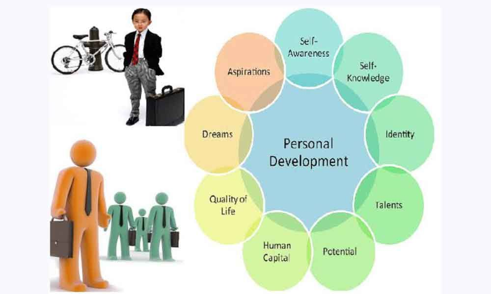

# Dinesh Yerramothu
My name is Dinesh Yerramothu and I am a Graduate student at **Northwest Missouri State University.** I would like to revolve my career as a **Developer** which I fondly call **"The art of play and code",** for I believe.
I'm confidential that every person has their own point of view and worldview, which is mostly shaped by their life experiences. Regardless of **one's life route,** the experience leaves a lasting impression on them and defines **how they interact with the world.** 
1. Personality
2. Attitude
3. Creativity
4. Experience
5. Perspective

 
